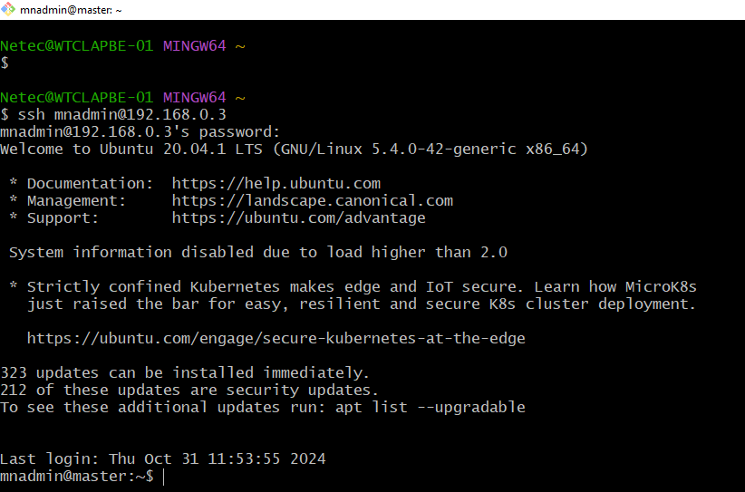
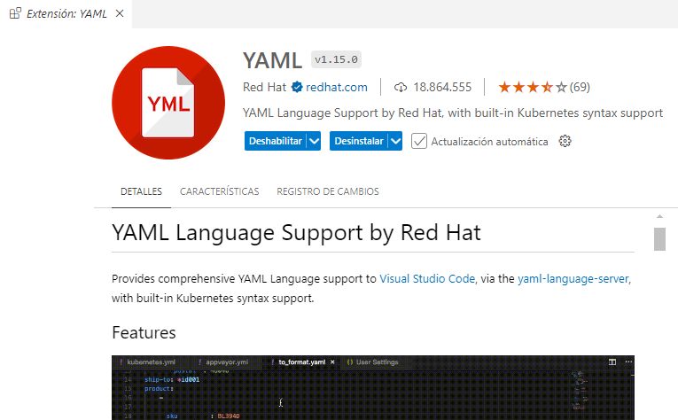

# Práctica 1.2. Verificación de Ambiente de Curso

## Objetivo
- Verificar y asegurar que todos los componentes necesarios para el curso están instalados y configurados correctamente en el entorno de trabajo.

## Duración aproximada
- 25 minutos.

<br/>

## Instrucciones

Las siguientes instrucciones aplican en tu máquina máquina virtual con Windows asignada.

1. **Configurar Git**

Asegúrate de tener configurados nombre y correo en Git. Esto se puede hacer con los siguientes comandos:

```bash
git config --global user.name "Tu Nombre"
git config --global user.email "tuemail@example.com"
git config --list
````

<br/>

2. **Clonar el repositorio del curso**

Clonar el repositorio proporcionado por el instructor para acceder a los archivos de práctica. Puedes hacerlo con:

```bash
git clone <URL_del_repositorio>
```

<br/>

3. **Verificar Maven (Opcional)**

Confirmar que tienes Maven instalado y configurado en el sistema. Esto es útil en caso de que necesites construir proyectos fuera del entorno de Spring Boot. Verificar la instalación ejecutando:

```bash
mvn -v
```

**Nota:** Aunque no es indispensable tener Maven configurado fuera del entorno de Spring, puede ser útil para tareas específicas.


<br/>


4. **Verificar Gradle (Opcional)**

Asegúrate de que Gradle esté instalado y configurado. Para verificar la instalación, utilizar:

```bash
gradle -v
```

<br/>


5. **Verificar Java 21**

Comprobar que tienes instalada la versión 21 de Java. Puedes verificar la versión ejecutando:

```bash
javac --version
java --version
```

<br/>


6. **Verificar Visual Studio Code (VSC)**

Asegúrate de tener Visual Studio Code instalado, ya sea pulsando el ícono de la aplicación en el escritorio o iniciando en la línea de comandos lo siguiente:

```bash
# Recuerda que el . significa el actual directorio de trabajo.
code .
```

<br/>


7. **Instalar los plugins requeridos en VSC**

Verificar que tienes los siguientes plugins instalados en Visual Studio Code para facilitar el desarrollo:

    - Extension Pack for Java v0.29.0
    - Docker v1.29.3
    - Kubernetes YAML Formatter v1.1.0
    - Kubernetes v1.3.18


<br/>


8. **Verificar Conexiones ssh*

Para cada una de las máquinas virtuales Ubuntu asignadas, verificar que puede conectarse vía ssh a las máquinas virtuales Ubuntu.

```bash
# El usuario podría ser mnadmin y la máquina tener la dirección 192.168.0.3
# La primera vez que e conectas al equipo confirma con **yes** que aceptas la conexión.
# La contraseña podría ser: Netec_123

ssh mnadmin@192.168.0.3
```

<br/> <br/>

## Resultado esperado

- ssh usuario@ip-maquina-virtual




<br/>


- Es complemento de YAML para VSC podría serte útil más adelante.


