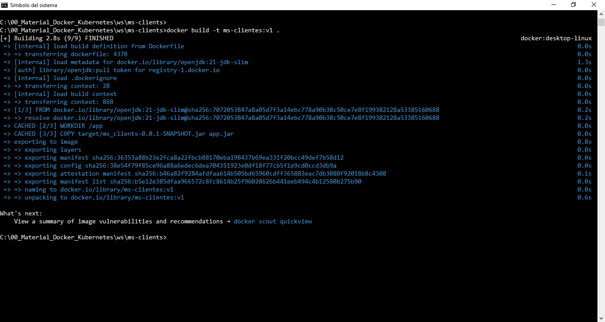
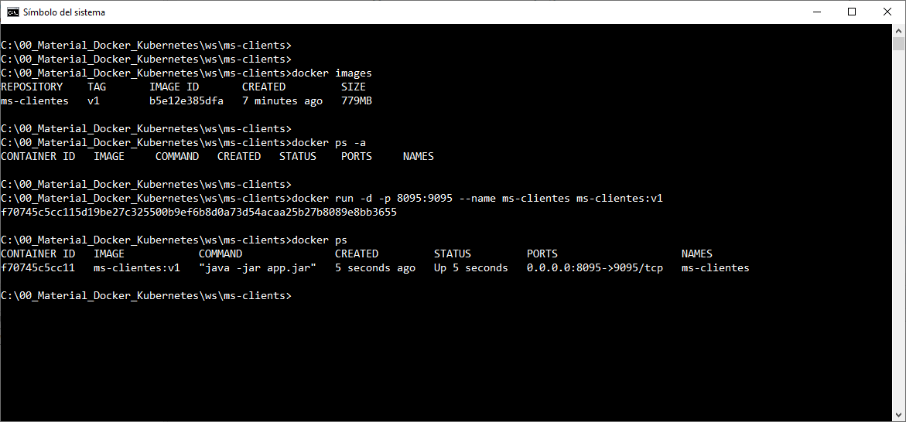
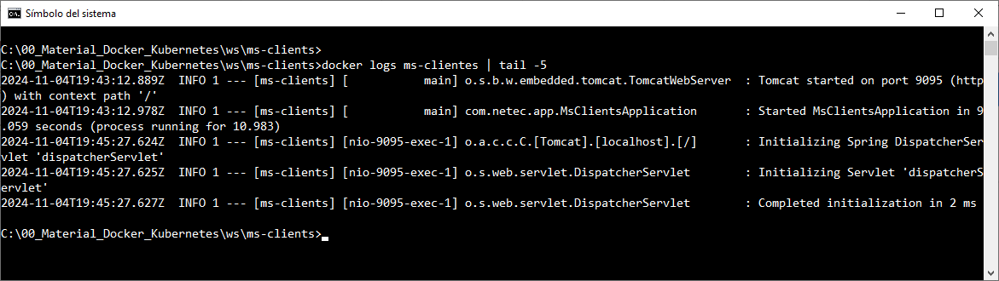

# Práctica 1.4. Construir imagen y contenedor Docker

## Objetivo

- Crear una imagen Docker a partir de un Dockerfile y desplegar un contenedor basado en esa imagen.

## Duración aproximada

- 30 minutos.

<br/>

### Instrucciones

1. **Crear un Dockerfile para la aplicación**

   - Navegar a la raíz del proyecto donde se encuentra tu aplicación Spring Boot.

   - Crear un archivo llamado `Dockerfile` (sin extensión).
   
   - Abrir el archivo `Dockerfile` y escribir las siguientes instrucciones básicas:

     ```dockerfile
     # Utilizar una imagen base de Java (ajusta la versión si es necesario).
     FROM openjdk:21-jdk-slim

     # Crear un directorio para la aplicación.
     WORKDIR /app

     # Copiar el archivo JAR generado al contenedor.
     COPY target/ms_clients-0.0.1-SNAPSHOT.jar app.jar

     # Exponer el puerto que usa la aplicación.
     EXPOSE 9095

     # Comando para ejecutar la aplicación.
     ENTRYPOINT ["java", "-jar", "app.jar"]
     ```

   - Guardar el archivo `Dockerfile`.


<br/>

2. **Construir la imagen Docker**

   - Abrir la terminal en el directorio raíz del proyecto.

   - Asegúrate de que el archivo JAR de la aplicación ya esté generado en la carpeta `target`. Si no está, ejecutar el siguiente comando para compilarlo:

     ```bash
     mvn clean package
     ```

    - **Nota**: Puedes compilarlo y empaquetarlo como se vió en clase, esto es con, `mvnw` en lugar de `mvn`.

   - Una vez que el archivo JAR esté listo, construir la imagen Docker con el siguiente comando (reemplaza `<nombre_de_imagen>` y `<versión>` por un nombre y versión para la imagen):

     ```bash
     docker build -t ms-clientes:v1 .
     ```


<br/>

3. **Verificar la imagen creada**

   - Ejecutar el siguiente comando para ver la lista de imágenes y confirmar que la imagen fue creada exitosamente:

     ```bash
     docker images
     ```

<br/>

4. **Desplegar un contenedor basado en la imagen**

   - Iniciar un contenedor a partir de la imagen creada, mapeando el puerto 8095 del contenedor al puerto 9095 de la máquina local:

     ```bash
     docker run -d -p 8095:9095 --name ms-clientes ms-clientes:v1
     ```

   - La aplicación debería estar disponible en `http://localhost:8095`.


<br/>


5. **Verificar que el contenedor esté en ejecución**

   - Usar el siguiente comando para listar los contenedores en ejecución y confirmar que la aplicación está desplegada:

     ```bash

     docker ps
     docker logs ms-clientes
     ```

<br/>

6. **Detener el contenedor**

   - Si deseas detener el contenedor en ejecución, identificar el `CONTAINER ID` usando el comando `docker ps`, y luego ejecutar:

     ```bash
     docker stop ms-clientes
     ```


<br/>


7. **Iniciar el contenedor**

   - Si deseas levantar el contenedor nuevamente, identificar el `CONTAINER ID` usando el comando `docker ps`, y luego ejecutar:

     ```bash
     docker start ms-clientes
     ```


<br/>
<br/>

## Resultado esperado

- Captura de pantalla al construir la imagen Docker.




<br/>

- Captura de pantalla que verifica las imagenes, verificar los contenedores, crear un nuevo contenedor y verificar el estado del nuevo contenedor.




<br/>

- Captura de pantalla que verifica que el contenedor Docker se encuentre en ejecución.


