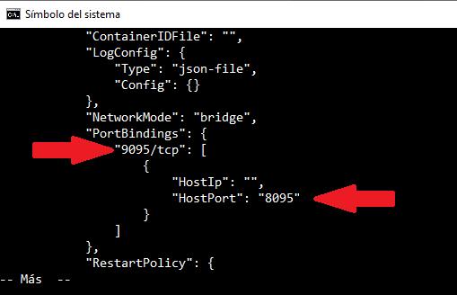
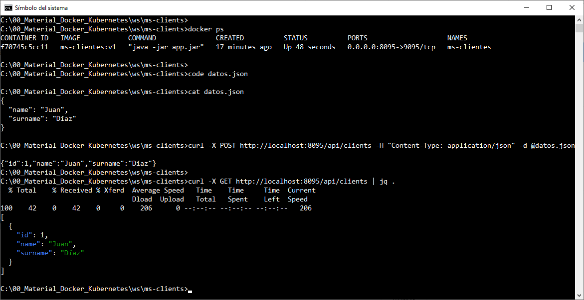

# Práctica 1.5. Consumir Microservicios

## Objetivo
- Consumir microservicios desde una aplicación cliente, utilizando llamadas HTTP para obtener, enviar y manipular datos.

## Duración aproximada
- 15 minutos.

<br/>

## Instrucciones

1. **Verificar el puerto expuesto en el contenedor Docker**

   - Listar los contenedores en ejecución para obtener el `CONTAINER ID` del microservicio:

     ```bash

     docker ps
     docker start ms-clientes # En caso de necesitar levantar el contenedor
     ```

   - Usar el siguiente comando para inspeccionar el contenedor y verificar el puerto HTTP expuesto:

     ```bash

     docker inspect ms-clientes | wc -l
     docker inspect ms-clientes | grep -i port
     docker inspect ms-clientes | grep -i address
     docker inspect ms-clientes | more
     ```

   - Buscar la sección `"Ports"` en la salida para confirmar el mapeo de puertos (interno y externo). El puerto externo será el que podrás usar para realizar las llamadas HTTP (por ejemplo, `9095`).

<br/>


2. **Consumir el microservicio**

   Puedes realizar las siguientes solicitudes HTTP para probar el microservicio desde Postman, Insomnia o `curl`. Asegúrate de reemplazar `{id}` con el valor del ID específico del cliente cuando sea necesario.

   - **Obtener todos los clientes**

     - **`curl`**:
       ```bash

       curl -X GET http://localhost:8095/api/clients
       ```
     - **Postman/Insomnia**:
       - Método: `GET`
       - URL: `http://localhost:8095/api/clients`


   - **Obtener un cliente por ID**

     - **`curl`**:
       ```bash

       curl -X GET http://localhost:8095/api/clients/{id}
       ```
     - **Postman/Insomnia**:
       - Método: `GET`
       - URL: `http://localhost:8095/api/clients/{id}`
       

   - **Crear un nuevo cliente**

     - **`curl`** (con archivo JSON):
       ```bash

       curl -X POST http://localhost:8095/api/clients -H "Content-Type: application/json" -d @client.json
       ```

       *Donde `client.json` contiene:*
       ```json

       {
         "name": "name1",
         "surname": "surname1"
       }
       ```

     - **Postman/Insomnia**:

       - Método: `POST`
       - URL: `http://localhost:8095/api/clients`
       - Cuerpo (raw JSON):
         ```json

         {
           "name": "name1",
           "surname": "surname1"
         }
         ```

   - **Actualizar un cliente existente**

     -  - **`curl`** (con archivo JSON):
       ```bash

       curl -X PUT http://localhost:8095/api/clients -H "Content-Type: application/json" -d @client.json
       ```

       *Donde `client.json` contiene:*

       ```json

       {
         "name": "<tu-nombre>",
         "surname": "<tu-apellido>"
       }
       ```

     - **Postman/Insomnia**:

       - Método: `PUT`
       - URL: `http://localhost:8095/api/clients`

       - Cuerpo (raw JSON):

         ```json

         {
           "name": "<tu-nombre>",
           "surname": "<tu-apellido>"
         }
         ```

   - **Eliminar un cliente**
     - **`curl`**:
       ```bash

       curl -X DELETE http://localhost:8095/api/clients/{id}
       ```
     - **Postman/Insomnia**:
       - Método: `DELETE`
       - URL: `http://localhost:8095/api/clients/{id}`


<br/>


3. **Verificar respuestas**

   - Confirmar que cada operación devuelve la respuesta esperada (por ejemplo, una lista de clientes, detalles de un cliente específico, o un mensaje de éxito al crear, actualizar o eliminar un cliente).


<br/><br/>

## Resultado esperado


- Captura de pantalla sobre el área del reporte de `docker inspect`.




<br/>


- Captura de pantalla sobre verificación del contenedor Docker y el consumo del microservicio usando curt y el método POST.


