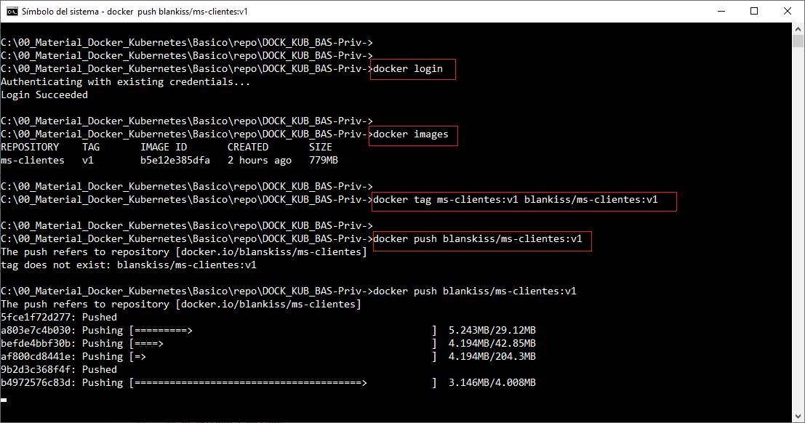
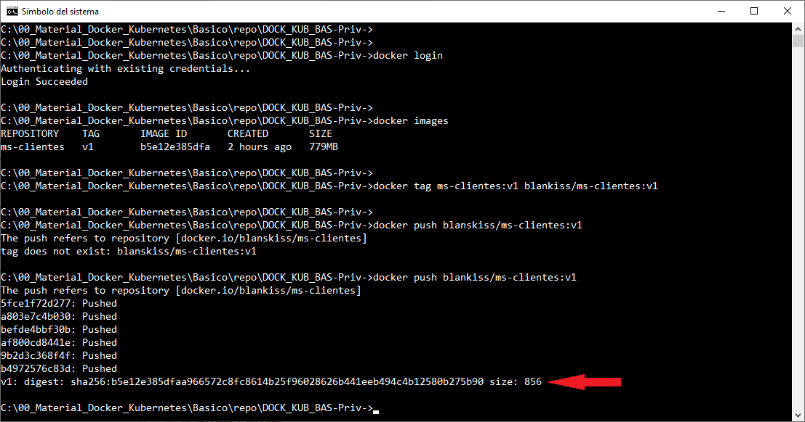
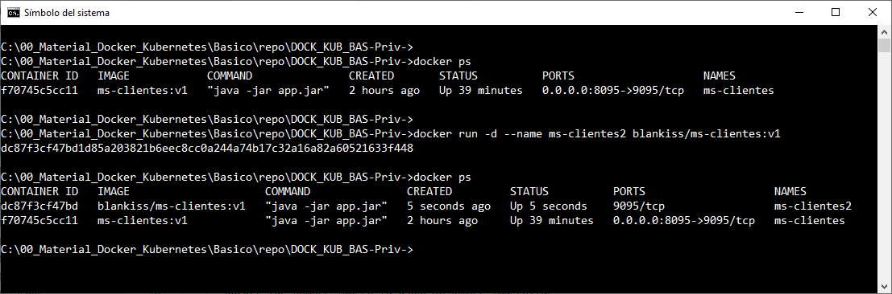
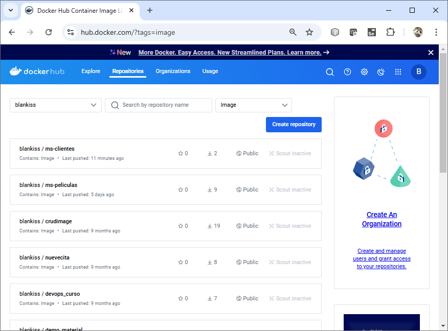

# Práctica 1.6. Docker Registry

## Objetivo
- Utilizar Docker Registry para almacenar y gestionar imágenes Docker de manera centralizada.


## Duración aproximada

- 20 minutos.

<br/>

## Instrucciones


### 1. Configurar Docker Hub o Docker Registry Local

   - **Opción 1: Docker Hub**
     1. Si aún no tienes una cuenta en Docker Hub, crear una en [https://hub.docker.com](https://hub.docker.com).


     2. Iniciar sesión en Docker desde la terminal:
        ```bash

        docker login
        ```

     3. Ingresar el nombre de usuario y contraseña cuando te los solicite.

   - **Opción 2: Docker Registry Local**
     1. Ejecutar un contenedor de Docker Registry en la máquina:
        ```bash

        docker run -d -p 5000:5000 --name registry registry:2
        ```

     2. Esto ejecutará un registro Docker en el puerto 5000 de la máquina.


<br/>


### 2. Etiquetar la imagen Docker

   - Identificar el nombre de la imagen que creaste en prácticas previas.

   - Etiquetar la imagen para que apunte al Docker Registry que usarás:

     - **Para Docker Hub**:
       ```bash

       docker tag nombre_imagen tu_usuario/nombre_imagen:tag
       ```

   - **Docker Registry Local**:

     ```bash
     docker run -d localhost:5000/nombre_imagen:tag
     ```


<br/>


## Resultado esperado


- Captura de pantalla, en el registro de usuario a Docker Hub, la creación del TAG de la imagen y la subida de la imagen.





<br/>


- Captura de pantalla, finalización del proceso de subida de la imagen a Docker Hub.





<br/>


- Captura de pantalla, verificación que se puede usar la imagen de Docker Hub para la construcción de un segundo contenedor.





<br/>


- Imagen en el Docker Hub.



