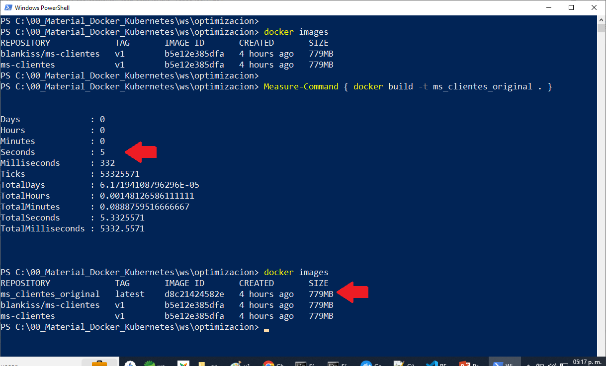
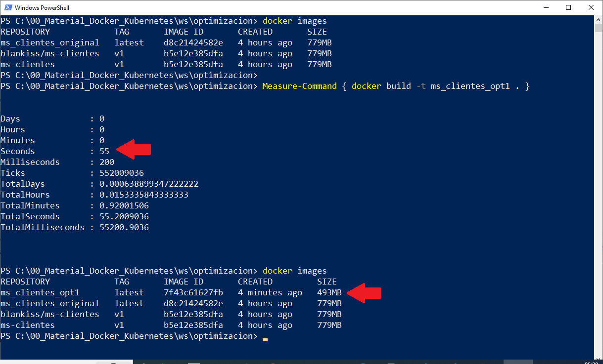
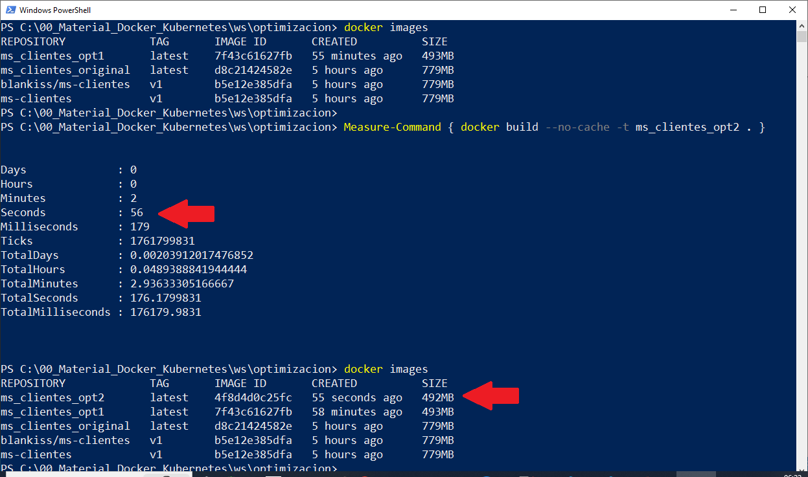
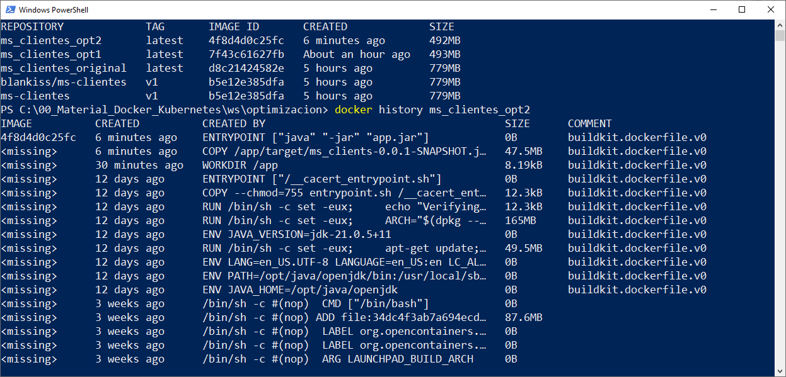

# Práctica 1.7. Optimización

## Objetivo
- Optimizar un Dockerfile aplicando prácticas recomendadas para reducir el tamaño de la imagen.
- Mejorar la velocidad de construcción y minimizar el uso de recursos.


## Duración aproximada
- 20 minutos.

<br/>

## Instrucciones

### Paso 1: Clonar el Dockerfile Actual

1. **Crear un Directorio de Trabajo:**

    - Crear un nuevo directorio donde puedas trabajar en la optimización del Dockerfile.

```bash
mkdir optimizacion
cd optimizacion
cp -rp <dir_proyecto>/src .
cp -p <dir_proyecto>/pom.xml .
cp -p <dir_proyecto>/target/ms_clients-0.0.1-SNAPSHOT.jar .
```

<br/>


2. **Copiar el Dockerfile Actual:**

    - Crear un archivo Dockerfile en este directorio y copiar el contenido actual:

```dockerfile
FROM openjdk:21-jdk-slim
WORKDIR /app
COPY ms_clients-0.0.1-SNAPSHOT.jar app.jar
EXPOSE 9096
ENTRYPOINT ["java", "-jar", "app.jar"]

```

<br/>


3. **Construir y medir la imagen original:**

    - Construir la imagen Docker con el siguiente comando y tomar nota del tiempo de construcción.
      
```bash
time docker build -t ms_clients_original .
```

- **Nota:** Si estas en Windows puedes usar una terminal Power Shell con la siguiente instrucción:

```PowerShell
Measure-Command { docker build -t ms_clients_original . }

```


- Verificar el tamaño de la imagen usando:

```bash
docker images  
```

- Registrar el tamaño de la imagen y el tiempo de construcción en la tabla como "Antes de Optimización".


<br/>

### Paso 2: Cambiar la imagen base para reducir el tamaño


1. **Cambiar de openjdk:21-jdk-slim a eclipse-temurin:21-jre-jammy:**

    - En el Dockerfile, reemplazar **openjdk:21-jdk-slim** con **eclipse-temurin:21-jre-jammy** para usar solo el entorno de ejecución (JRE) en lugar del kit de desarrollo (JDK). Esto reduce el tamaño porque solo necesitas ejecutar el JAR, no compilarlo.

    - Modificar el `Dockerfile`:

```dockerfile
FROM eclipse-temurin:21-jre-jammy
WORKDIR /app
COPY ms_clients-0.0.1-SNAPSHOT.jar app.jar
EXPOSE 9096
ENTRYPOINT ["java", "-jar", "app.jar"]
```

2. **Construir y medir el tamaño de la nueva imagen:**

    - Guardar el Dockerfile y construir de nuevo la imagen.

```bash
time docker build -t ms_clients_op1 .
```

- Verificar el tamaño de la imagen y el tiempo de construcción con los mismos comandos de antes. Registrar los resultados en la columna "Después de Optimización".


<br/>

### Paso 3: Implementar Multi-Stage Build (Compilación en Varias Etapas)

1. **Configurar etapa de compilación en el Dockerfile:**

    - Modificar el `Dockerfile` para implementar una compilación en varias etapas. En esta configuración, usar una imagen Maven para compilar el proyecto y luego solo copiar el archivo JAR compilado a una imagen más ligera.

    - Cambiar el `Dockerfile` a lo siguiente:

```dockerfile
# Etapa de construcción
FROM maven:3.8-eclipse-temurin-21 AS builder
WORKDIR /app
COPY pom.xml .
RUN mvn dependency:go-offline

COPY src ./src
RUN mvn package -Dmaven.test.skip=true

# Etapa de ejecución
FROM eclipse-temurin:21-jre
WORKDIR /app
COPY --from=builder /app/target/ms_clients-0.0.1-SNAPSHOT.jar app.jar
ENTRYPOINT ["java", "-jar", "app.jar"]

```


<br/>


2. **Construir la Imagen Multi-Stage:**

    - Guardar el archivo y construir la imagen.

```bash
time docker build -t ms_clients_opt2 .
```

- Verificar el tamaño de la imagen resultante y tomar nota del tiempo de construcción.


<br/>


3. **Actualizar la tabla de resultados:**

    - Registrar los valores en la columna "Después de Optimización".


<br/>

### Paso 4: Verificar el número de capas

1. **Inspeccionar las capas de la imagen:**

    - Para verificar cuántas capas tiene la imagen, usar el siguiente comando:

```bash
docker history ms_clients_optimized_multistage
```

    - Anotar el número de capas en la tabla para la imagen antes y después de la optimización.


<br/>

### Paso 5: Medir el tiempo de inicio del contenedor

1. **Ejecutar el contenedor y medir el tiempo de inicio:**

    - Ejecutar el contenedor y medir el tiempo de inicio para ver cuánto tarda en estar listo en el puerto 9095.

```bash
time docker run --rm -p 9095:9095 ms_clients_optimized_multistage
```

- Puedes observar en el registro de salida cuándo la aplicación está lista para recibir solicitudes y tomar nota del tiempo en segundos.

<br/>


2. **Actualizar la tabla con el tiempo de inicio:**

    - Anotar el tiempo de inicio en la tabla.


<br/>

### Paso 6: Observaciones y conclusiones

1. **Multi-Stage Build:** Asegúrate de registrar si se utilizó multi-stage build en la columna correspondiente de la tabla.


<br/>


2. **Comparación y análisis:**

    - Comparar los resultados antes y después de las optimizaciones.

    - Escribir una breve conclusión sobre cómo las optimizaciones afectaron el tamaño de la imagen, el tiempo de construcción y el tiempo de inicio.


<br/><br/>

## Resultado Esperado

- Captura de pantalla para la creación de la primera imagen base, en este caso, `ms_clientes_original`.



<br/>

- Captura de pantalla para la creación de la segunda imagen, cambiar solo la imagen base de Java, en este caso, `ms_clientes_opt1`.



<br/>

- Captura de pantalla para la creación de la tercera imagen, aplicar multi-stage, en este caso, `ms_clientes_opt2`.



<br/>

- Captura de pantalla revisando las étapas de la imagen `mx_clientes_opt2`.


