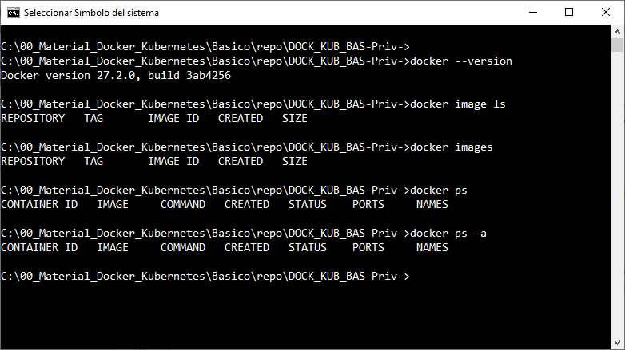
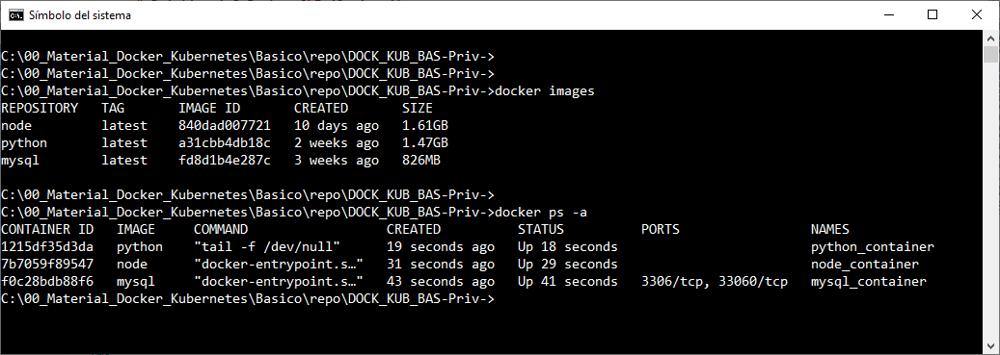
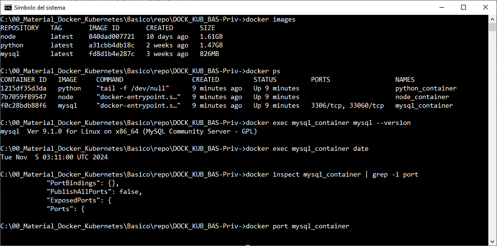

# Práctica 1.8. Docker CLI (Opcional)

## Objetivo

- Optimizar un Dockerfile aplicando prácticas recomendadas para reducir el tamaño de la imagen, mejorar la velocidad de construcción y minimizar el uso de recursos.


## Duración aproximada

- 20 minutos.

## Instrucciones

<br/>

### 1. Preparación inicial
   - Abrir una terminal y asegurarse de que Docker esté en funcionamiento.
   - Verificar la versión de Docker:
     ```bash
     docker --version
     ```

<br/>


### 2. Descargar imágenes de Docker Hub
   - Descargar las siguientes imágenes adicionales para familiarizarte con diferentes sistemas y aplicaciones:
 
     - `mysql`: Sistema de gestión de bases de datos.
     - `node`: Imagen base para aplicaciones Node.js.
     - `python`: Imagen base para aplicaciones Python.

   - Ejemplo de comando para cada imagen:
     ```bash
     docker pull mysql
     docker pull node
     docker pull python
     ```

<br/>


### 3. Construcción de contenedores
   - Crear un contenedor a partir de cada imagen descargada:
      - **MySQL**:
       ```bash
       docker run -d --name mysql_container -e MYSQL_ROOT_PASSWORD=abcd12345 mysql
       ```
     - **Node**:
       ```bash
       docker run -d --name node_container node tail -f /dev/null
       ```
     - **Python**:
       ```bash
       docker run -d --name python_container python tail -f /dev/null
       ```
   - Ahora tendrás varios contenedores corriendo simultáneamente, cada uno asociado con un sistema o aplicación diferente.

<br/>


### 4. Visualización de imágenes y contenedores
   - Listar todas las imágenes disponibles en tu sistema:
     ```bash
     docker images
     ```
   - Listar todos los contenedores, tanto activos como detenidos:
     ```bash
     docker ps -a
     ```

<br/>


### 5. Inspección detallada
   - **Puertos HTTP expuestos**: Confirma qué contenedores exponen puertos HTTP:
     ```bash
     docker ps
     docker port mysql_container
     ```
   - **Sistema Operativo**: Inspecciona el sistema operativo de cada contenedor:
     ```bash
     docker inspect <nombre_del_contenedor> | grep "Os"
     ```
   - **Fecha y Hora**: Muestra la fecha y hora actual en uno de los contenedores:
     ```bash
     docker exec mysql_container date
     ```

<br/>


### 6. Eliminación de contenedores e imágenes
   - **Detener y eliminar todos los contenedores**:
     ```bash
     docker stop $(docker ps -aq)   #  S.O. Linux
     docker rm $(docker ps -aq)  # S.O. Linux
     ```
   - **Eliminar todas las imágenes**:
     ```bash
     docker rmi $(docker images -q)  # S.O Linux
     ```

<br/>


### 7. Reflexión sobre el Docker Daemon y el CLI
   - Reflexionar sobre cómo la separación entre el Docker Daemon y el cliente CLI permite gestionar contenedores en otros servidores desde una máquina local.


<br/>

### Preguntas al finalizar la práctica

1. ¿Cuántas imágenes Docker se generaron?

2. ¿Cuántos contenedores Docker existen al finalizar la práctica?

3. ¿Cuáles son los puertos HTTP expuestos?

4. ¿Qué sistema operativo tiene cada contenedor creado en esta práctica?

5. ¿Cuál es la fecha y hora reportada en uno de los contenedores en ejecución?

6. Explica cómo la separación entre el Docker Daemon y el cliente CLI permite la interacción con contenedores en otros servidores.


<br/>
<br/>

## Resultado esperado

- Imágenes Docker.



<br/>


- Contenedores Docker.



<br/>


- Algunos comandos de Docker CLI.


