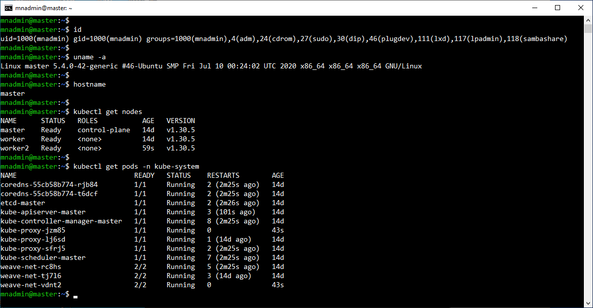
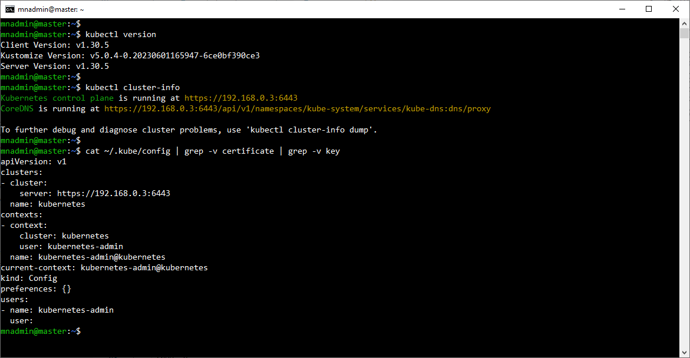
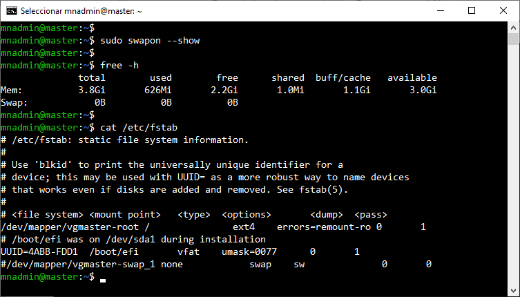

# Práctica 2.1. Verificación de instalación del Master Node  

## Objetivo 
- Verificar correctamente la instalación y configuración del nodo maestro (Master Node) en un clúster de Kubernetes.

## Duración aproximada
- 15 minutos.


## Requisitos previos:
- La instalación de Kubernetes ya está completada en un sistema Ubuntu Server 20.04.

<br/>

## Instrucciones:

1. **Acceso al nodo maestro.**  
   - Iniciar sesión en el nodo maestro utilizando SSH:
     ```bash
     ssh usuario@direccion-ip-del-master-node
     ```
    - **Nota:** EL usuario y la contraseña de las máquinas podría ser `mnadmin`y `Netec_123` respectivamente, estas podrían cambiar, el instructor lo coonfirmará.

<br/>


2. **Verificar el estado del clúster.**  
   - Ejecutar el siguiente comando para verificar si el clúster de Kubernetes está activo y en funcionamiento:
     ```bash
     kubectl get nodes
     ```
   - Asegúrate de ver el nodo maestro en la lista con el estado "Ready".

<br/>


3. **Comprobar el estado de los componentes del nodo maestro.**  
   - Para confirmar que todos los componentes del nodo maestro están operativos, ejecutar:
     ```bash
     kubectl get pods -n kube-system
     ```
   - Verificar que todos los pods del sistema están en estado "Running" o "Completed".


<br/>


4. **Comprobar la versión de Kubernetes.**  
   - Confirmar la versión de Kubernetes instalada en el nodo maestro:
     ```bash
     kubectl version 
     ```
   - Anotar la versión para validar que es la esperada para tu entorno.


<br/>


5. **Verificar configuración de red.**  
   - Ejecutar el siguiente comando para verificar la configuración de red del nodo maestro:
     ```bash
     kubectl cluster-info
     ```
   - Asegúrate de que los componentes de control del clúster (`kube-apiserver`, `etcd`, `kube-scheduler`, `kube-controller-manager`) tienen sus URL configuradas correctamente.

<br/>


6. **Validar la instalación del kubeconfig**  
   - Verificar que el archivo de configuración `kubeconfig` esté en la ubicación predeterminada y contenga la configuración correcta para el nodo maestro:
     ```bash
     file ~/.kube/config
     cat ~/.kube/config
     cat ~/.kube/config | grep -v data
     ```
   - Asegúrate de que la configuración esté correcta para acceder al clúster desde el nodo maestro.


<br/>


7. **Verificación del SWAP**
    - Ejecutar el siguiente comando para verificar el estado del swap.

    ```bash
     sudo swapon --show
     free -h
    ```

    - Si el primer comando no muesta ninguna salida, el swap está deshabilitado.
    
    - El la salida del segundo comando, el valodr de la columna "Swap" debería ser cero si el swap está desactivado.

    - Para asegurarte de que el swap se deshabilite permanentemente después de cada reinicio, verificar el contenido del archivo `/etc/fstab`, la(s) linea(s) con swap deberán de estar comentadas.


<br/>


8. **Finalizar**  
   - Tras verificar todos los puntos anteriores, confirmar que el nodo maestro está correctamente configurado y listo para operar en el clúster de Kubernetes.


<br/>


## Resultado esperado

- Captura de pantalla con el estado y version en los nodos y los pods en el espacio de nombre kube-system.



<br/>

 
- Captura de pantalla con verificaciones sobre kubectl e información del clúster.

 

<br/>

 
- Captura de pantalla con la verificación del SWAP. 


 
