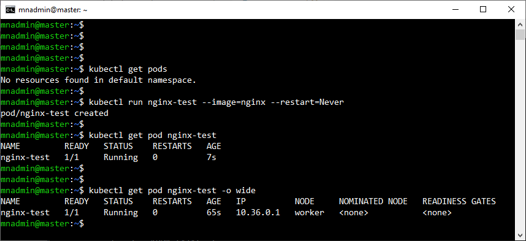

# Práctica 2.2. Verificación de instalación del Worker Node  

## Objetivo
- Verificar correctamente la instalación y configuración de un Worker Node en un clúster de Kubernetes.

## Duración aproximada
- 15 minutos.

<br/>

## Instrucciones

1. **Acceso al Worker Node**
   - Ingresar al Worker Node usando SSH:
     ```bash
     ssh usuario@ip_worker_node
     ```
   - **Notas**: 

        - Asegúrate de que la dirección IP sea correcta y que tengas permisos de usuario con privilegios adecuados en el nodo, wnadmin y contraseña Netec_123.
        - Para realizar estas actividades tienes que tener una conexión ssh a ambos nodos (Master & Worker Nodes)

<br/>

2. **Verificar conexión con el Master Node**
   - Comprobar si el Worker Node está correctamente unido al clúster usando el siguiente comando en el **Master Node**:
     ```bash
     kubectl get nodes
     ```
   - **Observación**: Deberías ver el Worker Node listado como `Ready`. Si aparece como `NotReady`, es posible que haya problemas con la configuración de red o de `kubelet` en el nodo trabajador.

<br/>

3. **Verificar el estado del servicio Kubelet en el Worker Node**
   - Ejecutar el siguiente comando en el Worker Node para comprobar el estado del `kubelet`:
     ```bash
     sudo systemctl status kubelet
     ```
   - **Observación**: El servicio debe estar activo (`active (running)`). Si no lo está, intentar reiniciarlo usando:
     ```bash
     sudo systemctl restart kubelet
     ```
<br/>

4. **Verificar el registro en el clúster**
   - Ejecutar este comando en el Worker Node para verificar que el nodo está registrado:
     ```bash
     sudo journalctl -u kubelet | grep "Node has joined"
     ```
   - **Observación**: Este mensaje confirma que el Worker Node ha establecido comunicación con el clúster. Si no aparece, revisar los logs de `kubelet` para identificar posibles errores.
   ```bash
     sudo journalctl -u kubelet -n 50
     ```

<br/>

5. **Validar que el nodo puede ejecutar pods**
   - En el Master Node, desplegar un pod de prueba en el Worker Node:
     ```bash
     kubectl run nginx-test --image=nginx --restart=Never --node-selector="kubernetes.io/hostname=<worker-node-name>"
     ```
   - **Observación**: Cambiar `worker-node-name` por el nombre del Worker Node que aparece en `kubectl get nodes`. Luego, verificar el estado del pod con:

     ```bash
     kubectl get pod nginx-test
     ```
   - Si el pod no se ejecuta en el Worker Node, verificar la configuración de `kubelet` y los permisos del nodo.

<br/>

7. **Eliminar el Pod de Prueba**
   - Una vez verificada la correcta ejecución del pod, eliminar el pod de prueba:
     ```bash
     kubectl delete pod nginx-test
     ```


<br/>


## Resultado esperado

- Captura de pantalla para verificar los nodos del clúster, un mater node y worker node listos.


<br/>

- Captura de pantalla en el nodo worker, `kubelet` activo.


<br/>

- Captura de pantalla con la creación de un pod, el antes y despues de recrear el Pod.


<br/>

- Captura de pantalla con la verificación del nodo donde fue creado el Pod. (10.36.0.1 worker/192.168.0.228).


