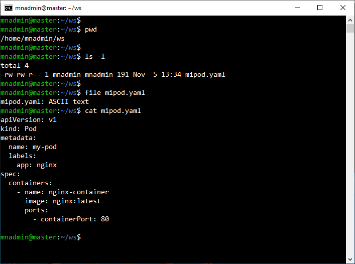
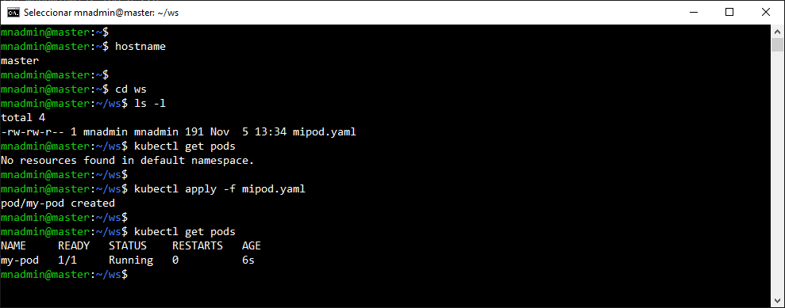
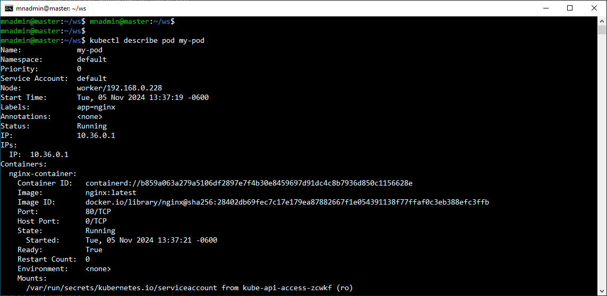
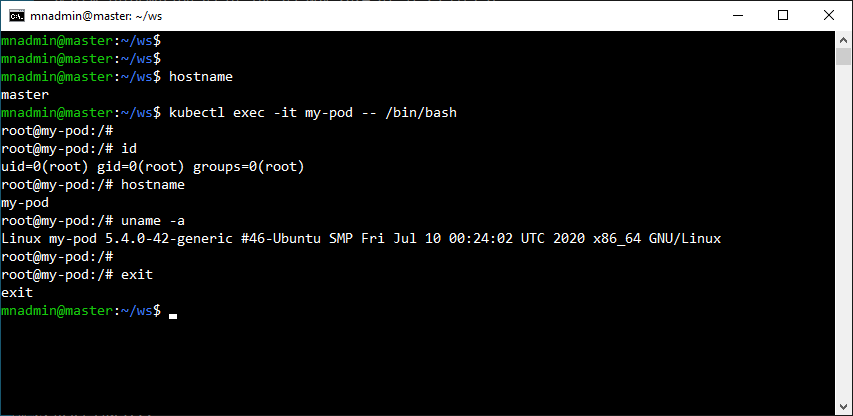
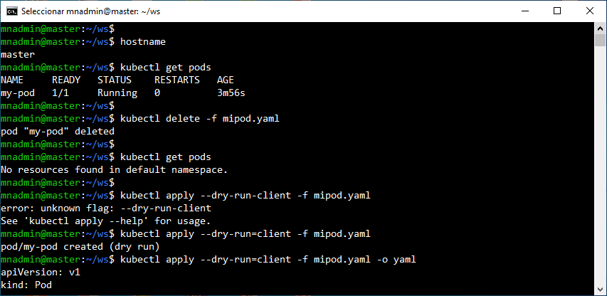

# Práctica 2.4. Creación declarativa de un Pod

## Objetivo

- Crear un Pod en Kubernetes utilizando un enfoque declarativo mediante archivos YAML.

## Duración aproximada

- 15 minutos.

## Requisitos previos

- Tener acceso a un clúster de Kubernetes en funcionamiento.
- Contar con acceso a la CLI de Kubernetes (kubectl) desde la terminal y permisos para aplicar configuraciones en el clúster.
- Conocer los conceptos básicos de YAML y la estructura de archivos de configuración de Kubernetes.

<br/>

## Instrucciones

**Paso 1: Crear el archivo YAML para el Pod**

1. Abrir un editor de texto preferido y crear un archivo llamado mipod.yaml.

<br/>

2. En este archivo, escribir el siguiente contenido YAML, que define un Pod simple con un contenedor de nginx:

```yaml
apiVersion: v1
kind: Pod
metadata:
  name: my-pod
  labels:
    app: nginx
spec:
  containers:
    - name: nginx-container
      image: nginx:latest
      ports:
        - containerPort: 80
```

<br/>

3. Contestar lo siguiente referente al YAML.

    a. ¿Qué campo define la versión de la API de Kubernetes utilizada en el archivo de configuración?
    
    b. ¿Qué campo indica el tipo de recurso que se va a crear en Kubernetes, como un Pod?
    
    c. ¿Qué campo proporciona información del Pod, incluyendo su nombre y etiquetas?
    
    d. ¿Qué campo define las especificaciones de un Pod en Kubernetes?
    
    e. ¿Qué campo dentro de spec contiene una lista de contenedores definidos en el Pod?
    
    f. ¿Qué campo especifica el nombre del contenedor dentro de un Pod?
    
    g. ¿Qué campo define la imagen de contenedor que se utilizará?
    
    h. ¿Qué campo define el puerto expuesto dentro del contenedor?


<br/>

**Paso 2: Aplicar la configuración del Pod**

1. Abrir la terminal y navegar al directorio donde guardaste `mipod.yaml`.

<br/>

2. Ejecutar el siguiente comando para aplicar la configuración en el clúster de Kubernetes:

```bash

kubectl apply -f mipod.yaml

```

- Este comando creará el Pod en el clúster basado en la configuración especificada en el archivo YAML.

<br/>

3. Verificar que el Pod se ha creado correctamente con el siguiente comando:

```bash

kubectl get pods

```

- Deberías ver una lista de Pods en el clúster, incluyendo my-pod. El estado del Pod debe aparecer como Running si se ha creado correctamente.


<br/>

**Paso 3: Probar el Pod**

- Puedes verificar los detalles del Pod usando el comando:

```bash
kubectl describe pod my-pod
```

- Este comando muestra información detallada sobre el Pod, como su IP, eventos, e información de los contenedores.

- Si deseas acceder al contenedor dentro del Pod, puedes ejecutar:

```bash

kubectl exec -it my-pod -- /bin/bash

```
 
- Esto abrirá una sesión de terminal en el contenedor nginx del Pod.


<br/>

**Paso 4: Eliminar el Pod**

- Una vez que hayas terminado, puedes eliminar el Pod para liberar recursos en el clúster. Ejecutar:

```bash

kubectl delete -f my-pod.yaml

```

- Este comando eliminará el Pod my-pod usando la configuración declarativa.

- **Notas adicionales**

    - La creación de recursos en Kubernetes mediante archivos YAML es una práctica recomendada, ya que permite un fácil versionado y reutilización de la configuración.
    
    - Puedes modificar el archivo **mipod.yaml** para especificar otros contenedores, etiquetas o configuraciones para experimentar con diferentes Pods.


<br/><br/>

## Resultado esperado

- Captura de pantalla que muestra basicamente el contenido del YAML.

 

<br/>

- Captura de pantalla que muestra el antes, durante y después de crear un Pod, de nombre: `my-pod`.

 

<br/>

- Captura de pantalla que muestra con más detalles del Pod recientemente creado.

 

<br/>

- Captura de pantalla que muestra como conectarse al container dentro del Pod.

 

<br/>

- Captura de pantalla que muestra la eliminación del Pod, así como la opción `apply-run=client`.

 

<br/>
