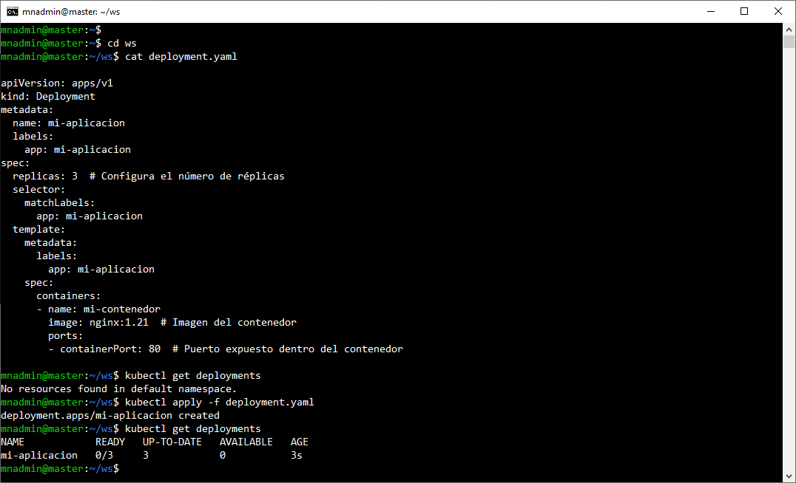
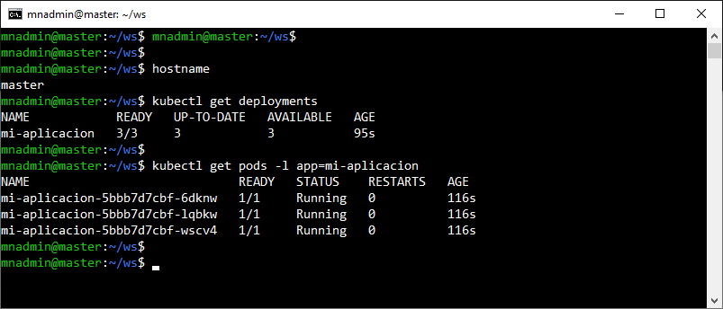
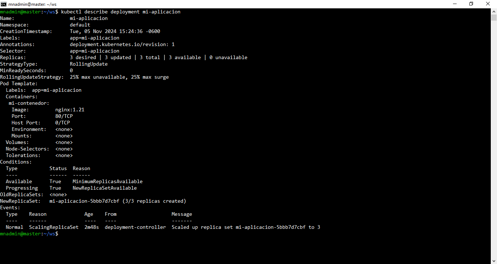
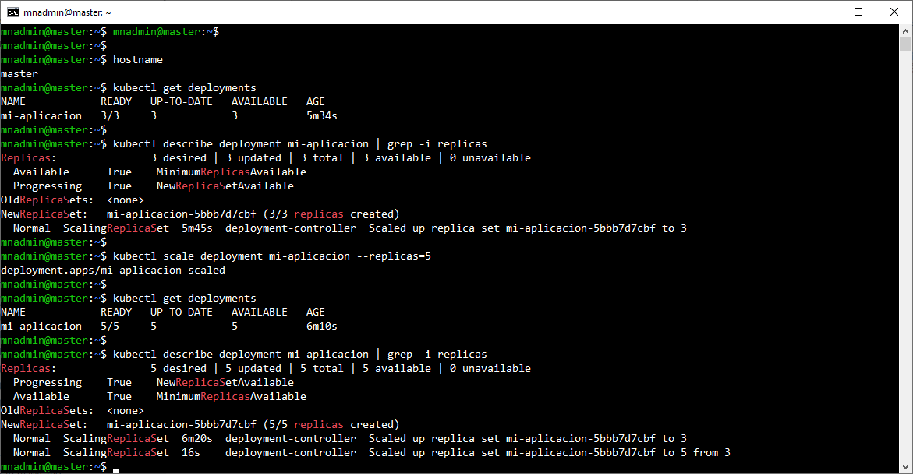
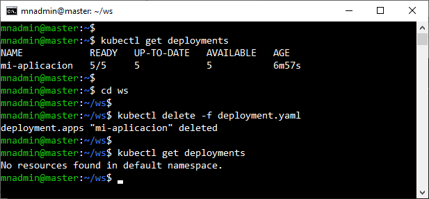

# Práctica 3.1. Escribiendo YAML de un Deployment

## Objetivo 
- Escribir y aplicar un archivo YAML para crear un Deployment, configurando el número de réplicas, contenedores y puertos necesarios para desplegar aplicaciones en el clúster.

## Duración aproximada
- 20 minutos.

## Instrucciones

1. **Crear el archivo YAML**

    a. Abrir un editor de texto y crea un archivo llamado **deployment.yaml**.

    b. Escribir el siguiente YAML como ejemplo básico para un Deployment en Kubernetes. Este archivo describe la configuración necesaria para desplegar una aplicación.

```yaml

apiVersion: apps/v1
kind: Deployment
metadata:
  name: mi-aplicacion
  labels:
    app: mi-aplicacion
spec:
  replicas: 3  # Configuramos el número de réplicas.
  selector:
    matchLabels:
      app: mi-aplicacion
  template:
    metadata:
      labels:
        app: mi-aplicacion
    spec:
      containers:
      - name: mi-contenedor
        image: nginx:1.21  # Imagen del contenedor.
        ports:
        - containerPort: 80  # Puerto expuesto dentro del contenedor.
```

<br/>

2. **Configurar los valores según la aplicación**

    - **replicas**: Cambia el valor de replicas para definir el número de réplicas de los pods.
    - **image**: Cambia el nombre y la versión de la imagen del contenedor en image según la aplicación que quieras desplegar.
    - **containerPort**: Modifica el puerto expuesto en el contenedor si tu aplicación utiliza un puerto distinto.

<br/>

3. **Aplicar el Deployment en el clúster**

    - Abrir una terminal en la ubicación donde guardaste el archivo `deployment.yaml`.

    - Ejecutar el siguiente comando para aplicar el archivo YAML en el clúster:

```bash
 
kubectl apply -f deployment.yaml
```

-   Verificar que el Deployment se haya creado correctamente ejecutando:

```bash
 
kubectl get deployments
```

<br/>

4. **Validar los Pods creados por el Deployment**

- Para verificar que los pods se hayan iniciado correctamente:

```bash
 
kubectl get pods -l app=mi-aplicacion
```
 
 <br/>

5. **Visualizar detalles del Deployment**

- Para obtener más detalles sobre el Deployment creado:

```bash
 
kubectl describe deployment mi-aplicacion

```

<br/>


6. **Escalar el Deployment (Opcional)**

-   Si deseas cambiar el número de réplicas, puedes modificar el valor de replicas en **deployment.yaml** y volver a aplicar el archivo, o bien usar el siguiente comando para escalar el Deployment directamente:

```bash
 
kubectl scale deployment mi-aplicacion --replicas=5
```
 

<br/>


7. **Limpiar los recursos (Opcional)**

- Cuando hayas terminado, puedes eliminar el Deployment y sus recursos asociados con:

```bash
 
kubectl delete -f deployment.yaml
```
 

<br/>


## Resultado esperado

- Captura de pantalla con el YAML a aplicar en la práctica 3.1, además muestra el antes y después de aplicar el YAML.



<br/>

- Captura de pantalla que muestra la cantidad de replicas de la aplicación y el estado de las mismas.



<br/>

- Captura de pantalla que muestra la descripción del despliegue.



<br/>

- Captura de pantalla que muestra el antes y después de escalar de tres a cinco replicas.



<br/>

- Captura de pantalla que muestra el antes y después de eleminiar el deployment.



<br/>
