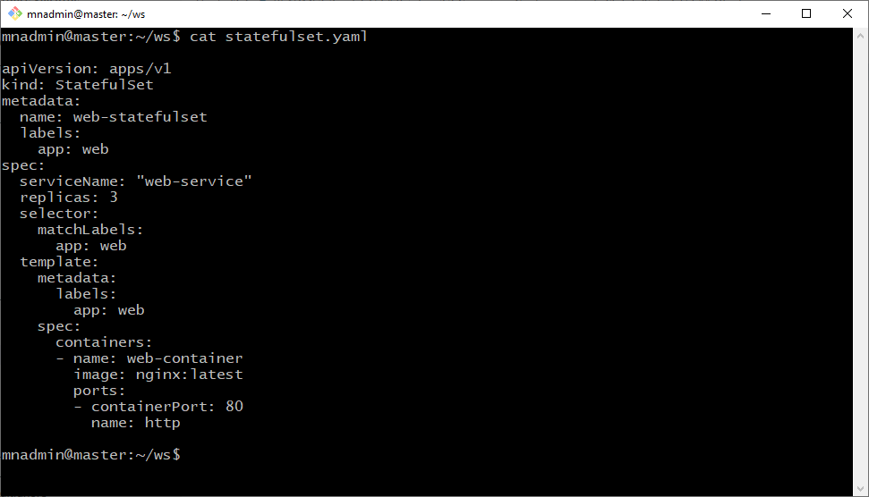

# Práctica 3.2. Creación y configuración de StatefulSets

## Objetivo
- Escribir y aplicar un archivo YAML para crear un StatefulSet.

## Duración aproximada
- 30 minutos.

## Instrucciones

### Paso 1: Crear el archivo YAML del StatefulSet

1. Abrir un editor de texto y crear un archivo llamado `statefulset.yaml`.

2. Copiar el siguiente contenido en el archivo:

   ```yaml
   apiVersion: apps/v1
   kind: StatefulSet
   metadata:
     name: web-statefulset
     labels:
       app: web
   spec:
     serviceName: "web-service"
     replicas: 3
     selector:
       matchLabels:
         app: web
     template:
       metadata:
         labels:
           app: web
       spec:
         containers:
         - name: web-container
           image: nginx:latest
           ports:
           - containerPort: 80
             name: http

<br/>


-   **Observaciones** 

    -   `apiVersion` y `kind`: Especifican el tipo de recurso, en este caso, un StatefulSet de versión `apps/v1`.
    - `metadata`: Incluye el nombre y etiquetas del StatefulSet.
    - `spec.replicas`: Indica el número de réplicas deseadas.
    - `selector`: Define los criterios de selección de pods (a través de etiquetas).
    - `template`: Define el pod que el StatefulSet creará, incluyendo las etiquetas y especificación del contenedor.
    - `containers`: Define el contenedor que se utilizará en el StatefulSet. Se usa la imagen `nginx:latest` para simular una aplicación simple, expuesta en el puerto 80.


<br/>

### Paso 2: Aplicar el archivo YAML para crear el StatefulSet

- Asegúrate de que el clúster de Kubernetes esté activo y accesible.
- Ejecutar el siguiente comando en la terminal para aplicar el archivo YAML y crear el StatefulSet:

```bash
kubectl apply -f statefulset.yaml
```


<br/>

### Paso 3: Verificar la creación del StatefulSet

- Para comprobar que el StatefulSet y sus pods han sido creados correctamente, ejecutar:

```bash
kubectl get statefulsets
kubectl get pods -l app=web
```

- Esto mostrará el StatefulSet y los pods con el nombre secuencialmente numerado, por ejemplo, `web-statefulset-0`, `web-statefulset-1`, `web-statefulset-2`.


<br/>

### Paso 4: Detalles adicionales y observación de los pods

- Para ver detalles específicos del StatefulSet y monitorear los logs de los pods, puedes utilizar:

- Ver detalles del StatefulSet:

  ```bash
  kubectl describe statefulset web-statefulset
  ```

- Ver los logs de un pod específico (por ejemplo, web-statefulset-0):

  ```bash
  kubectl logs web-statefulset-0
  ```

<br/>

### Paso 5: Escalar el StatefulSet (Opcional)

- Si deseas aumentar o reducir el número de réplicas, puedes editar el archivo YAML o usar el comando scale de kubectl:

```bash
kubectl scale statefulset web-statefulset --replicas=5
```

- Este comando ajustará el número de réplicas a cinco.

<br/>

### Paso 6: Eliminar el StatefulSet (Limpieza)

- Una vez finalizada la práctica, puedes eliminar el StatefulSet con el siguiente comando:


```bash
 kubectl delete -f statefulset.yaml
```

- Esto eliminará el StatefulSet y todos los pods asociados a él.

<br/>

## Resultado Esperado

- Captura de pantalla con el YAML almacenado en el archivo **statefulset.yaml**.



<br/>

- Captura de pantalla con el antes y después de aplicar el YAML **statefulset.yaml**.


 
 <br/>

- Captura de pantalla con el detalle del web-statefulset (SuccessfulCreate).


<br/>

- Captura de pantalla la bitácora de uno de los statefulset. Además con la escalada a cinco replicas.


<br/>

- Captura de pantalla con el antes y después de eliminar el **statefulset.yaml**


 
