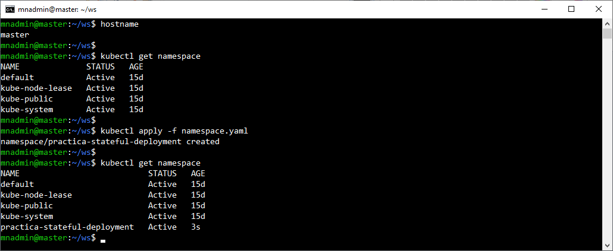

# Práctica 3.3. Comparación entre StatefulSets y Deployments con ResourceQuota

## Objetivo

- Implementar y diferenciar un StatefulSet y un Deployment, aplicando una ResourceQuota.

## Duración aproximada

- 30 minutos.

## Instrucciones

### 1. Crear un Namespace

1. Crear un **Namespace** dedicado para esta práctica. Esto permite aplicar la **ResourceQuota** únicamente en los recursos que despliegues en este entorno aislado.

```yaml
apiVersion: v1
kind: Namespace
metadata:
  name: practica-stateful-deployment
```

2. Aplicar el archivo:

```bash
kubectl apply -f <nombre_del_archivo>.yaml
```

<br/>

### 2. Definir una ResourceQuota

1. En el Namespace creado, definir una **ResourceQuota** que limite los recursos disponibles para el conjunto de aplicaciones. Esto ayuda a observar cómo Kubernetes administra los recursos cuando se aplican a diferentes tipos de workloads.

```yaml
apiVersion: v1
kind: ResourceQuota
metadata:
  name: practica-quota
  namespace: practica-stateful-deployment
spec:
  hard:
    pods: "5"
    requests.cpu: "2"
    requests.memory: "4Gi"
    limits.cpu: "3"
    limits.memory: "6Gi"
```

2. Aplicar el archivo de la ResourceQuota:

```bash

kubectl apply -f resource-quota.yaml
```

<br/>

### 3. Crear un Deployment

1. Definir el Deployment en el archivo deployment.yaml:

```yaml

apiVersion: apps/v1
kind: Deployment
metadata:
  name: nginx-deployment
  namespace: practica-stateful-deployment
spec:
  replicas: 3
  selector:
    matchLabels:
      app: nginx
  template:
    metadata:
      labels:
        app: nginx
    spec:
      containers:
      - name: nginx
        image: nginx:latest
        resources:
          requests:
            cpu: "500m"
            memory: "1Gi"
          limits:
            cpu: "1"
            memory: "2Gi"
```

2. Aplicar el archivo del Deployment:

```bash

kubectl apply -f deployment.yaml
```

<br/>

### 4. Crear un StatefulSet

1. Definir el StatefulSet en el archivo statefulset.yaml:

```yaml

apiVersion: apps/v1
kind: StatefulSet
metadata:
  name: web-statefulset
  namespace: practica-stateful-deployment
spec:
  serviceName: "web"
  replicas: 3
  selector:
    matchLabels:
      app: web
  template:
    metadata:
      labels:
        app: web
    spec:
      containers:
      - name: web
        image: nginx:latest
        resources:
          requests:
            cpu: "500m"
            memory: "1Gi"
          limits:
            cpu: "1"
            memory: "2Gi"
        volumeMounts:
        - name: www
          mountPath: "/usr/share/nginx/html"
  volumeClaimTemplates:
  - metadata:
      name: www
    spec:
      accessModes: ["ReadWriteOnce"]
      resources:
        requests:
          storage: 1Gi
```

2. Aplicar el archivo del StatefulSet:

```bash

kubectl apply -f statefulset.yaml
```

<br/>

### 5. Verificar el comportamiento y los recursos

1. Listar los pods creados en el Namespace:

```bash

kubectl get pods -n practica-stateful-deployment
```

2. Inspeccionar los pods de ambos recursos (Deployment y StatefulSet) para observar las diferencias en la asignación de nombres y el comportamiento en el orden de creación y eliminación de los pods:

```bash

kubectl describe pod <nombre_del_pod> -n practica-stateful-deployment
```

<br/>

### 6. Validar ResourceQuota

1. Verificar el estado de la ResourceQuota y cómo se distribuyen los recursos entre el Deployment y el StatefulSet:

```bash

kubectl get resourcequota practica-quota -n practica-stateful-deployment
```

2. Comprobar si los límites de la ResourceQuota afectan la creación de réplicas adicionales en el Deployment o el StatefulSet al intentar modificar sus valores de replicas. Por ejemplo, intentar aumentar las réplicas del Deployment:

```yaml
spec:
  replicas: 6
```

3. Aplicar el cambio en el archivo deployment.yaml y observar el impacto en los recursos:

```bash

kubectl apply -f deployment.yaml
kubectl get pods -n practica-stateful-deployment
```

<br/>

### 7. Analizar resultados

1. Documentar las observaciones sobre cómo Kubernetes maneja las asignaciones de nombres de los pods en StatefulSet versus Deployment.

2. Comparar cómo cada uno responde a las restricciones impuestas por la ResourceQuota, tomando en cuenta el número de réplicas que permite crear sin superar los límites.

<br/>

### Conclusión

- Reflexionar sobre las siguientes preguntas para comprender mejor la aplicación de StatefulSet y Deployment:

    a. ¿Cuál es la diferencia principal en el comportamiento de StatefulSet y Deployment cuando se aplican límites de recursos?

    b. ¿Cuándo es más conveniente usar StatefulSet versus Deployment?

    c. ¿Cómo influye la ResourceQuota en la planificación de recursos de un clúster de Kubernetes?

<br/><br/>

## Resultado esperado

- Captura de pantalla muestra el contenido del YAML para crear un espacio de nombres.


<br/>

- Captura de pantalla muestra los espacios de nombres antes y después de crear el espacio de nombres para la práctica.



<br/>

- Captura de pantalla muestra el contenido del YAML para crear un **ResourceQuota** en el espacio de nombres especificado.


<br/>


- Captura de pantalla muestra el antes y después de crear un **ResourceQuota** en el espacio de nombres especificado.


<br/>


- Captura de pantalla que muestra el YAML para crear un **Deployment** en el espacio de nombres específico.


<br/>


- Captura de pantalla que muestra la creación del **Deployment** y el antes y despues de la creacion de un **Statefulset**.


<br/>


- Captura de pantalla con parte de la descripción del Pod creado con las limitantes en los recursos de cpu y memoria.


<br/>


- Captura de pantalla que muestra el estado del **ResourceQuota** em el espacio de nombres especifico.


<br/>


- Captura de pantalla que muestra la eliminación del espacio de nombres.


<br/>


